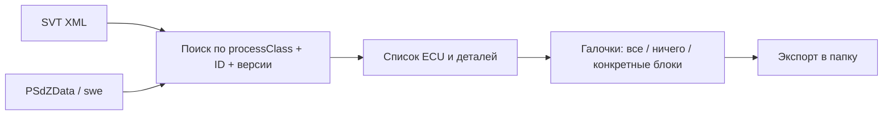

# SVT → PSdZData Export

Лёгкая Windows-утилита: читает BMW **SVT XML**, ищет соответствующие SWE-файлы в **PSdZData** и копирует выбранные блоки в заданную папку.

Подходит, чтобы вытащить мини-набор `psdzdata/swe` под конкретную машину (CAFD/BTLD/SWFL/SWFK), не таская весь датасет.

## Что делает



- Разбирает ECU из SVT: адрес, `baseVariant`, `nameBNTN`, все `partIdentification`
- Индексирует `psdzdata/swe/{btld,swfl,swfk,cafd,...}`
- Сопоставляет имя файла вида `cafd_00004146.caf.003_037_007`
- Показывает **найдено / нет / есть другие версии**
- Экспортирует только отмеченные блоки и типы
- Пишет `svt_export_manifest.txt`

## Запуск

Нужен [Python 3](https://www.python.org/downloads/) (`py -3`).

```bat
start.bat
```

или

```bat
py -3 app.py
```

1. Укажите папку PSdZData (корень Lite/Full или сам `psdzdata`)
2. Укажите SVT XML
3. Укажите папку экспорта
4. **Найти файлы**
5. Отметьте блоки: **Все** / **Ничего** / галочки на ECU или отдельной детали
6. **Экспорт выбранных**

Готовый exe: `.\build.ps1` → `dist\SVT-PSdZ-Export.exe`

## Демо

В `demo/` лежит учебный SVT и крошечный fake-PSdZData. Реальных прошивок BMW там нет — только placeholder-файлы, чтобы увидеть найденные и отсутствующие детали.

```bat
.\demo\run-demo.ps1
```

или вручную:

```bat
py -3 app.py --svt demo\sample-svt.xml --psdz demo --out demo\out --layout psdzdata
```

GUI на демо-данных:

```bat
py -3 app.py
```

Затем укажите `demo` как PSdZData и `demo\sample-svt.xml` как SVT.

Что должно получиться на демо:

| ECU | Деталь | Ожидание |
|---|---|---|
| `0D HKFM2` | BTLD `00004692` `011_000_000` | найден (bin + xml) |
| `0D HKFM2` | SWFL `00004693` `005_000_000` | найден (bin + xml) |
| `0D HKFM2` | CAFD `0000570F` `008_000_020` | найден |
| `0D HKFM2` | HWEL `00005C62` | нет файла (так и должно быть) |
| `08 SRR` | CAFD `00004146` `003_037_007` | найден |
| `08 SRR` | BTLD / SWFL | нет в этом наборе |
| `08 SRR` | CAFD `00004146` | рядом лежит другая версия `003_037_004` |

Пример структуры после экспорта:

```text
demo/out/
  svt_export_manifest.txt
  psdzdata/swe/btld/btld_00004692.bin.011_000_000
  psdzdata/swe/btld/btld_00004692.xml.011_000_000
  psdzdata/swe/swfl/swfl_00004693.bin.005_000_000
  psdzdata/swe/swfl/swfl_00004693.xml.005_000_000
  psdzdata/swe/cafd/cafd_0000570f.caf.008_000_020
  psdzdata/swe/cafd/cafd_00004146.caf.003_037_007
```

На полной PSdZData вместо placeholder появятся настоящие `.bin` / `.caf` / `.xml`. В **Lite** часто заполнен только `swe/cafd` — BTLD/SWFL будут красными, это нормально.

## CLI

```bat
py -3 app.py --svt "C:\path\svt.xml" --psdz "C:\PSdZData 4.60.11 Lite" --out "D:\export"
```

Опция `--layout`:

| Значение | Куда копирует |
|---|---|
| `psdzdata` (по умолчанию) | `psdzdata/swe/<тип>/файл` — удобно для E-Sys |
| `swe` | `swe/<тип>/файл` |
| `ecu` | папка на каждый блок |
| `flat` | все файлы в корень |

## Замечания

- HWEL/HWAP по умолчанию не экспортируются: это обычно не SWE-бинарники
- Один и тот же файл, если он у нескольких ECU, копируется один раз
- Уже существующий файл того же размера пропускается
- Пути запоминаются в `svt_export.json` рядом с программой
