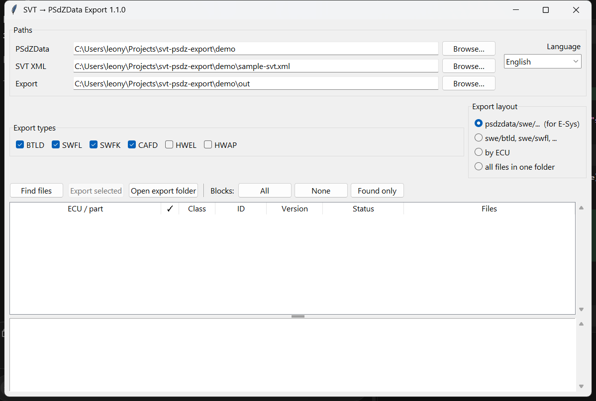
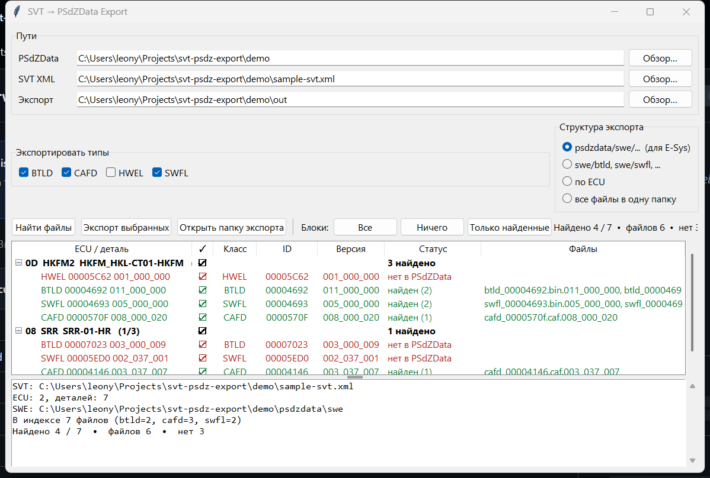
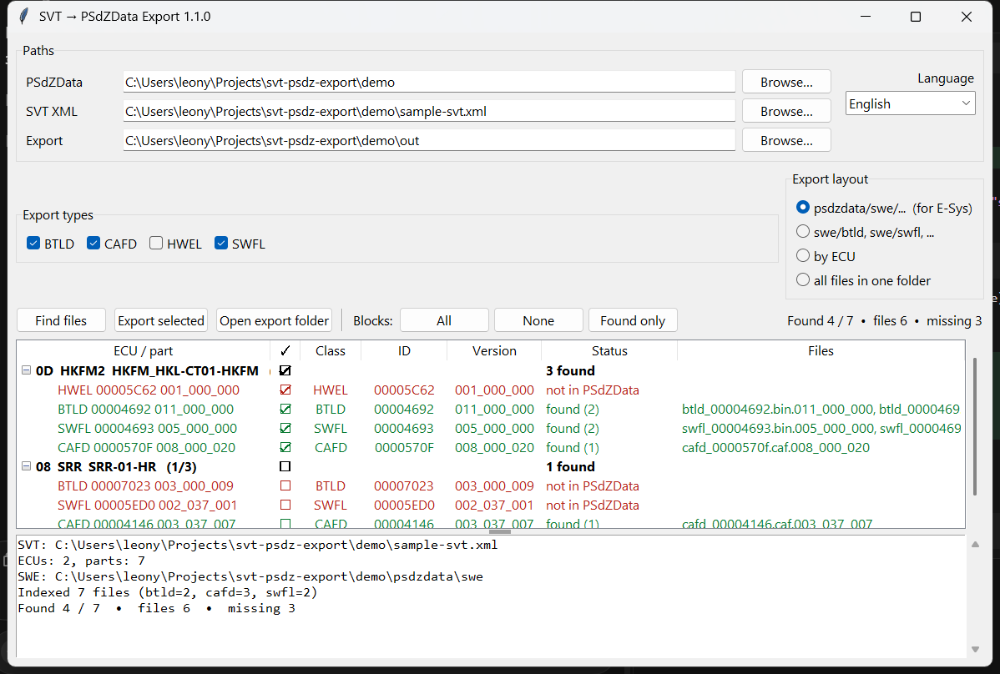
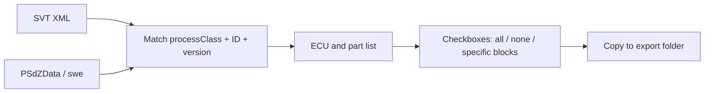

# SVT → PSdZData Export

**Version 1.1.0** — Windows tool that reads a BMW **SVT XML**, finds matching SWE files in **PSdZData**, and copies the selected ECUs into a folder.

Use it to build a small `psdzdata/swe` set for one car (CAFD / BTLD / SWFL / SWFK) instead of shipping the full dataset.

UI languages: **English, Deutsch, Українська, Русский**. First launch follows the Windows UI language. You can change it in the window; the choice is stored in `svt_export.json`.

## Screenshots

Startup with paths filled in:



Search result on the demo SVT: found parts in green, missing parts in red.



Per-block checkboxes (SRR unchecked, HKFM2 kept):



## How it works



- Parses each ECU from the SVT: diagnostic address, `baseVariant`, `nameBNTN`, every `partIdentification`
- Indexes `psdzdata/swe/{btld,swfl,swfk,cafd,...}`
- Matches names such as `cafd_00004146.caf.003_037_007`
- Marks rows as **found**, **missing**, or **other version available**
- Exports only checked blocks and types
- Writes `svt_export_manifest.txt`

## Run

Python 3 (`py -3`):

```bat
start.bat
```

or

```bat
py -3 app.py
```

Force a language:

```bat
py -3 app.py --lang en
```

1. Set the PSdZData folder (Lite/Full root or `psdzdata` itself)
2. Set the SVT XML
3. Set the export folder
4. **Find files**
5. Select blocks: **All** / **None** / checkboxes on an ECU or a single part
6. **Export selected**

Build a standalone exe: `.\build.ps1` → `dist\SVT-PSdZ-Export.exe`

## Demo

`demo/` ships a sample SVT and a tiny fake PSdZData. There are no real BMW binaries — only placeholders so you can see found vs missing rows.

```bat
.\demo\run-demo.ps1
```

or

```bat
py -3 app.py --svt demo\sample-svt.xml --psdz demo --out demo\out --layout psdzdata
```

GUI on demo data:

```bat
py -3 app.py --demo
```

Expected demo result:

| ECU | Part | Result |
|---|---|---|
| `0D HKFM2` | BTLD `00004692` `011_000_000` | found (bin + xml) |
| `0D HKFM2` | SWFL `00004693` `005_000_000` | found (bin + xml) |
| `0D HKFM2` | CAFD `0000570F` `008_000_020` | found |
| `0D HKFM2` | HWEL `00005C62` | no file (expected) |
| `08 SRR` | CAFD `00004146` `003_037_007` | found |
| `08 SRR` | BTLD / SWFL | not in this pack |
| `08 SRR` | CAFD `00004146` | older version `003_037_004` is also present |

Example export tree:

```text
demo/out/
  svt_export_manifest.txt
  psdzdata/swe/btld/btld_00004692.bin.011_000_000
  psdzdata/swe/btld/btld_00004692.xml.011_000_000
  psdzdata/swe/swfl/swfl_00004693.bin.005_000_000
  psdzdata/swe/swfl/swfl_00004693.xml.005_000_000
  psdzdata/swe/cafd/cafd_0000570f.caf.008_000_020
  psdzdata/swe/cafd/cafd_00004146.caf.003_037_007
```

On a full PSdZData the placeholders become real `.bin` / `.caf` / `.xml` files. **Lite** packs often have `swe/cafd` only — BTLD/SWFL stay red. That is normal.

## CLI

```bat
py -3 app.py --svt "C:\path\svt.xml" --psdz "C:\PSdZData 4.60.11 Lite" --out "D:\export"
```

`--layout`:

| Value | Output |
|---|---|
| `psdzdata` (default) | `psdzdata/swe/<type>/file` — handy for E-Sys |
| `swe` | `swe/<type>/file` |
| `ecu` | one folder per ECU |
| `flat` | every file in the export root |

## Notes

- HWEL/HWAP are off by default; they are usually not SWE binaries
- The same file used by several ECUs is copied once
- An existing file of the same size is skipped
- Last paths and language are stored in `svt_export.json` next to the app
